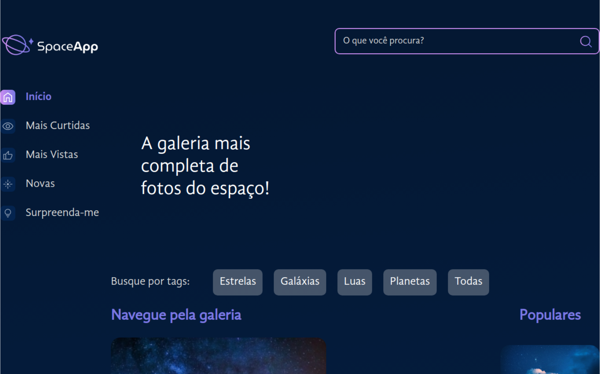

# SpaceApp

> Projeto desenvolvido para estudos e prática em React e Styled Components.

## 🚀 Tecnologias

## 💻 Projeto

O projeto consiste em uma galeria da galáxia com diversas fotos, podendo ser filtradas através das tags de busca ou da barra de pesquisa. Também com uma modal para ver as imagens em alta escala.
 
 
Teste o projeto clicando [aqui](https://space-app-amber.vercel.app/)

## 📝 Licença

Esse projeto está sob licença. Veja o arquivo [LICENÇA](LICENSE) para mais detalhes.
